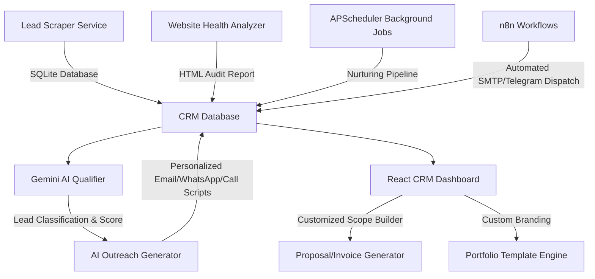

# Apex Website Agency Operating System 🚀

Apex is an all-in-one, free, self-hosted website agency operating system. It automates B2B lead acquisition, analyzes website metrics, qualifies leads using Google Gemini AI, generates personalized outreach copy, organizes a sales pipeline CRM, drafts professional proposals, and generates client-specific landing page prototypes.

---

## System Architecture



---

## Core Modules

1. **Lead Scraper**: Scrapes B2B leads from Google Maps, Justdial, and IndiaMART. Saves business metrics to a SQLite database.
2. **Website Analyzer**: Audits target site load speeds, HTTPS security certificates, mobile responsiveness, broken links, meta tags, and missing alt tags. Generates printable HTML audit pages.
3. **AI Lead Qualification**: Uses Gemini to score leads (Hot, Warm, Cold) and projects conversion probabilities.
4. **AI Personalized Outreach**: Drafts customized campaign materials for Email, WhatsApp, LinkedIn, Instagram, and Cold Calling.
5. **CRM Pipeline**: Integrates a complete client lifecycle tracking pipeline (New Lead &rarr; Won/Lost).
6. **Proposal Generator**: Custom formats quotations, invoices, proposals, and contracts in clean, print-friendly HTML formats.
7. **CRM Dashboard**: Dark-themed SPA dashboard built with React and Tailwind CSS featuring metrics charts.
8. **Automation Engine**: Seamless triggers for n8n webhooks and background schedule runs.
9. **Scheduler**: Handles hourly queue checks, nightly scans, and weekly CRM status reports.
10. **Portfolio Generator**: Dynamically compiles customizable single-page landing site templates for Restaurants, Gyms, Dentists, Clinics, Salons, Schools, and Real Estate agents.
11. **Analytics Dashboard**: Tracks SMTP delivery, response rates, and performance statistics across niches.

---

## Folder Structure

```
/leads-agency-system
├── backend/
│   ├── app/
│   │   ├── api/          # FastAPI Routes (leads, analyzer, ai, proposals, portfolio, analytics)
│   │   ├── db/           # SQLite Database Models and Connection Scaffolds
│   │   ├── services/     # Engine logic (Scraping, Audits, Gemini AI, Contracts, Schedules)
│   │   └── main.py       # API Entrypoint & CORS setup
│   ├── requirements.txt  # Python requirements
│   └── Dockerfile        # Python dependencies + Playwright browser binaries
├── frontend/
│   ├── src/
│   │   ├── components/   # Modular CRM Panels (DashboardView, LeadsView, ProposalsView, PortfoliosView, AnalyticsView)
│   │   ├── App.jsx       # Layout coordinates and tab routing
│   │   ├── index.css     # Tailwind directives and custom CSS
│   │   └── main.jsx      # React mounting bootstrap
│   ├── package.json      # React dependencies
│   ├── tailwind.config.js# Tailwind config rules
│   └── Dockerfile        # Multi-stage Nginx build script
├── n8n/
│   └── workflows.json    # Preconfigured n8n triggers JSON workflow
├── docker-compose.yml    # App container orchestration
└── README.md             # This document
```

---

## Getting Started

### Local Manual Installation

#### 1. Setup Backend Services
```bash
cd backend
python -m venv venv
# On Windows
venv\Scripts\activate
# On macOS/Linux
source venv/bin/activate

pip install -r requirements.txt
playwright install chromium
playwright install-deps chromium
```

Create a `.env` file in the workspace root copy-pasting parameters from `.env.example`.
Run the FastAPI developer server:
```bash
uvicorn app.main:app --reload --port 8000
```
API Documentation is available interactively at `http://127.0.0.1:8000/docs`.

#### 2. Setup React CRM Dashboard
Open a new terminal window:
```bash
cd frontend
npm install
npm run dev
```
The application dashboard is now running locally at `http://localhost:5173`.

---

## Docker Deployment (Recommended)

Run the entire system in containerized environments with a single command:
```bash
docker-compose up --build -d
```
- **React UI Portal**: Accessible on port `80` at `http://localhost`.
- **FastAPI Documentation**: Accessible on port `8000` at `http://localhost:8000/docs`.
- Volumes `backend-data` and `backend-static` ensure SQLite records and HTML proposals are persistent.

---

## API Documentation Quick Reference

| Method | Endpoint | Description |
| :--- | :--- | :--- |
| `GET` | `/api/leads/` | Fetch leads list with optional category/status filters |
| `POST` | `/api/leads/` | Create a manual lead profile card |
| `POST` | `/api/leads/scrape` | Trigger background lead search scraper |
| `POST` | `/api/analyzer/audit/{lead_id}` | Run technical website health audit and generate report card |
| `POST` | `/api/ai/qualify/{lead_id}` | Qualify conversion probability using Gemini AI |
| `POST` | `/api/ai/outreach/{lead_id}` | Generate personalized email, WhatsApp, and call scripts |
| `POST` | `/api/proposals/generate` | Compile Quotation/Invoice/Contract PDFs |
| `GET` | `/api/portfolio/preview/{lead_id}` | Render customized niche landing pages (e.g. Restaurant, Gym) |
| `GET` | `/api/analytics/dashboard` | Aggregated statistics for KPI graphs |
